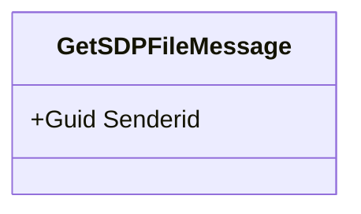
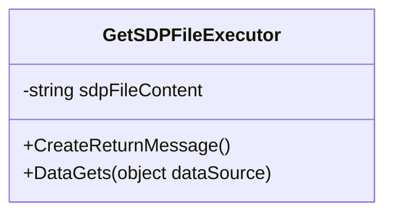
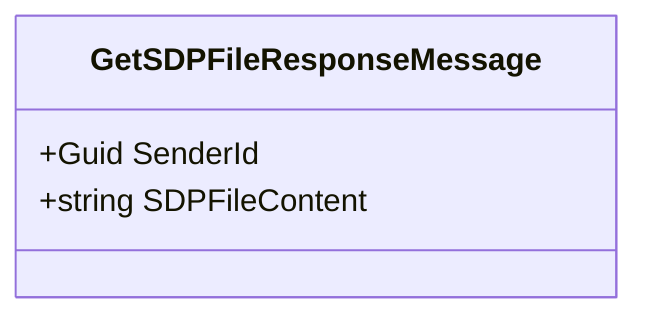

# Request SDP file content using InterApp message
The objective is to allow requesting SDP file content for a specific sender from any protocol that integrates with device which supports SDP files. `InterApp` framework is used in order to make this way of communication possible. 
> **Note**
> This is already implementend in AMWA NMOS IS-05 protocol, version 1.0.0.3.
* For more information about `InterApp`, see [InterApp classes | DataMiner Docs](https://docs.dataminer.services/develop/devguide/ClassLibrary/ClassLibraryInterAppClasses.html).
### Processing incoming request
To retrieve SDP file content for a specific sender, sender ID should be provided as part of incoming `InterApp` message. In this case, that message is represented in a form of a class `GetSDPFileMessage`.
##### GetSDPFileMessage
The `GetSDPFileMessage` is being used to store sender ID which will be provided from external automation script and driver will use it in order to know which SDP value should be retrieved. Sender ID represents primary key from `Senders table` in the used protocol. `GetSDPFileMessage` class is a part of `Skyline.DataMiner.ConnectorAPI.SDP NuGet package`.
Class diagram

##### GetSDPFileExecutor
The `GetSDPFileExecutor` class implements couple of very useful methods for manipulating and processing `InterApp` messages. In this case, `GetSDPFileExecutor` class will take care of getting the correct value for SDP file and creating an response object which will be exposed to the calling automation script.

Class diagram:

In order to retrieve SDP file content from `Senders table`, from method `DataGets(object dataSource)` call another method `GetParameterIndexByKey(iPID, key, iY)`. The resulting object is SDP file content for specified sender ID.
```csharp
public override void DataGets(object dataSource)
{
	SLProtocol protocol = dataSource as SLProtocol; // Can be replaced if other dataSource type is used.
	if (protocol != null)
	{
		sdpFileContent = Convert.ToString(protocol.GetParameterIndexByKey(Parameter.Senders.tablePid, Convert.ToString(Message.SenderId), Parameter.Senders.Idx.senderssdpfile_string_315 + 1));
	}
}
```
After getting necessary data, method `CreateReturnMessage()` will make sure that the value from SDP column is exposed to the calling automation script. Apart from SDP file content, as a part of response, sender ID will be exposed as well.
```csharp
public override Message CreateReturnMessage()
{
	return new GetSDPFileResponse()
	{
		Guid = Message.Guid,
		SenderId = Message.SenderId,
		SDPFileContent = sdpFileContent,
	};
}
```
### Sending response back
The response object will be returned to the calling automation script as an object of a class `GetSDPFileResponseMessage`. 
##### GetSDPFileResponseMessage
The `GetSDPFileResponseMessage` is being used to store sender ID and SDP file content which will be exposed to the calling script in a form of a response. `GetSDPFileResponseMessage` class is a part of `Skyline.DataMiner.ConnectorAPI.SDP NuGet package`.
Class diagram:

To be able to send response back, in the QAction dedicated for handling InterApp communication, we create a new Message.
```csharp
var message = MessageFactory.CreateFromRaw(raw, customSerializer);

if (message.TryExecute(protocol, protocol, messageToExecutorMapping, out Message returnMessage) && returnMessage != null)
{
	returnMessage.Send(protocol.SLNet.RawConnection, message.ReturnAddress.AgentId, message.ReturnAddress.ElementId, message.ReturnAddress.ParameterId, customSerializer);
}
```
#### SDP Response example
The following example provides a preview of the SDP structure and offers insights into what we can anticipate as a response.
##### SDP File content
```
v=0
o=- 3905215086 3905215086 IN IP4 10.13.1.142
s=easy-nmos-node/sender/v1
t=0 0
a=group:DUP PRIMARY SECONDARY
m=video 5004 RTP/AVP 96
c=IN IP4 232.22.143.250/32
a=ts-refclk:localmac=02-42-0A-0D-01-8E
a=mediaclk:direct=0
a=source-filter: incl IN IP4 232.22.143.250 10.13.1.142
a=rtpmap:96 raw/90000
a=fmtp:96 width=1920; height=1080; exactframerate=25; interlace; sampling=YCbCr-4:2:2; depth=10; colorimetry=BT709; TCS=SDR; PM=2110GPM; SSN=ST2110-20:2017; TP=2110TPN
a=mid:PRIMARY
m=video 5004 RTP/AVP 96
c=IN IP4 232.145.141.205/32
a=ts-refclk:localmac=02-42-0A-0D-01-8E
a=mediaclk:direct=0
a=source-filter: incl IN IP4 232.145.141.205 10.13.1.142
a=rtpmap:96 raw/90000
a=fmtp:96 width=1920; height=1080; exactframerate=25; interlace; sampling=YCbCr-4:2:2; depth=10; colorimetry=BT709; TCS=SDR; PM=2110GPM; SSN=ST2110-20:2017; TP=2110TPN
a=mid:SECONDARY
```