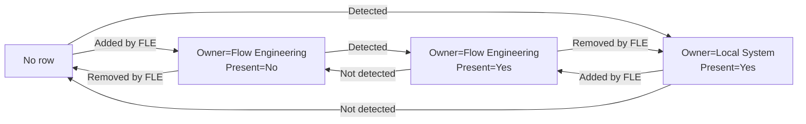

# Flow Engineering Connector Example

Example DataMiner connector that demonstrates how to support generic flow engineering (FLE) tables via InterApp messages.

The objective is to create a mediation layer using generic tables. 
This allows to track which incoming and outgoing flows are passing through an element in a standardized way.
The tables are mostly populated with data that is coming from the device, but also extended with metadata from flow engineering itself.
Flows can be multicast streams, SDI or ASI connections, and more.
These tables are used by the MediaOps solution to show the **as-is** path, which represents the actual route a specific signal takes through the devices.

## Implementation
### Protocol.xml

 - Copy tables 9991000, 9991100, 9991200 and 9991300
 - Copy relations
 - Copy QAction 9991000 (including code)

### Skyline.DataMiner.FlowEngineering.Protocol namespace

The `Skyline.DataMiner.FlowEngineering.Protocol` namespace contains useful classes and methods that assist developers to fill in the FLE tables in an object oriented way.

[Link to code](QAction_1/Skyline/DataMiner/FlowEngineering/Protocol)

To get access to the main 'manager' object call the `FlowEngineeringManager.GetInstance(protocol)` method. The resulting object is the main entry point of the helper classes.
```csharp
var flowEngineering = FlowEngineeringManager.GetInstance(protocol);
```

Use properties and lists to add/update/remove data in the object structure:
```csharp
flowEngineering.Interfaces.Add(new Interface("...") { ... });
flowEngineering.Interfaces["10"].AdminStatus = InterfaceAdminStatus.Up;

flowEngineering.IncomingFlows.Add(new RxFlow("...") { ... });
flowEngineering.OutgoingFlows.Add(new TxFlow("...") { ... });
...
```

After adapting properties in the objects, the tables can be updates using the following methods:
```csharp
flowEngineering.Interfaces.UpdateTable(protocol);
flowEngineering.IncomingFlows.UpdateTable(protocol);
flowEngineering.OutgoingFlows.UpdateTable(protocol);
```

> [!NOTE]
> Data is being cached in the SLScripting process. To ensure that all old data is cleared, it's recommended to call `FlowEngineeringManagerInstances.CreateNewInstance(protocol)` after startup.

### FLE Interfaces table
The `FLE Interfaces Overview Table` lists all interfaces that are eligible for flow engineering.

Example code:
```csharp
var flowEngineering = FlowEngineeringManager.GetInstance(protocol);
var dcfInterfaceHelper = DcfInterfaceHelper.Create(protocol);
var newInterfaces = new List<Interface>();

foreach (var ifConfig in interfacesConfig)
{
	var ifIndex = Convert.ToString(ifConfig.InterfaceNumber);

	if (!flowEngineering.Interfaces.TryGetValue(ifIndex, out var intf))
		intf = new Interface(ifIndex);

	intf.Description = $"Ethernet{ifIndex}";
	intf.DisplayKey = $"Ethernet{ifIndex}";
	intf.Type = InterfaceType.Ethernet;
	intf.AdminStatus = InterfaceAdminStatus.Down;
	intf.OperationalStatus = InterfaceOperationalStatus.Down;
	intf.DcfInterfaceId = dcfInterfaceHelper.TryFindInterface(1, ifIndex, out var dcfIntf) ? dcfIntf.ID : -1;

	newInterfaces.Add(intf);
}

flowEngineering.Interfaces.ReplaceInterfaces(newInterfaces);
flowEngineering.Interfaces.UpdateTable(protocol);
```

> [!NOTE]
> Some columns are automatically calculated and don't need to be filled in:
>  - Rx/Tx Flows
>  - Rx/Tx Expected Flows
>  - Rx/Tx Expected Bitrate

The `DCF Interface ID` column is important in order to be able to follow the as-is path. To obtain the the DCF interface ID based on `parameter group` and `index`, the following helper method can be used.
It's advised to cache the `dcfInterfaceHelper` variable when being called multiple times in a loop.

```csharp
var dcfInterfaceHelper = DcfInterfaceHelper.Create(protocol);
dcfInterfaceHelper.TryFindInterface(1 /* parameter group */, interfaceIndex, out var dcfIntf);
var dcfInterfaceID = dcfIntf.ID;
```

### Incoming and Outgoing Flows table
These tables contains information about incoming and outgoing flows on the device.

 - information about the signal itself (transport type, IP address, port, ...)
 - incoming/outgoing interface
 - expected bitrate and comparison with actual bitrate
 - indication if the signal is present or not
 - ownership (local system or flow engineering)
 - foreign keys which link incoming and outgoing flows
 - ...

> [!IMPORTANT]
> The content of the rows in the flow tables should primarily originate from information retrieved from the device. This is crucial because the main objective is to accurately track the **as-is** path of flows.

Add as minimum:
 - IP
	- Transport Type
	- Destination IP
	- Destination Port (when available)
	- Source IP
	- Interface
 - SDI/ASI
	- Transport Type
	- Interface

Where possible also add FKs:
 - From incoming flow to outgoing flows (1-1 or 1-N relation)
 - From outgoing flow to incoming flows (N-1 relation)

Also see [example connections](#example-connections).

Example code:
```csharp
var flowEngineering = FlowEngineeringManager.GetInstance(protocol);
var newFlows = new List<Flow>();

// handle current flows
foreach (var mrnh in multicastRouteNextHops)
{
	var instance = String.Join("/", mrnh.SourceAddress, mrnh.GroupAddress, mrnh.InterfaceIndex);

	if (!flowEngineering.OutgoingFlows.TryGetValue(instance, out var flow))
	{
		// new flow
		flow = new TxFlow(instance)
		{
			TransportType = FlowTransportType.IP,
			FlowOwner = FlowOwner.LocalSystem,
			Label = mrnh.Label,
			DestinationIP = mrnh.GroupAddress,
			DestinationPort = -1,
			SourceIP = mrnh.SourceAddress,
			Interface = mrnh.InterfaceIndex,
			ForeignKeyIncoming = String.Join("/", mrnh.GroupAddress, mrnh.SourceAddress),
		};

		flowEngineering.OutgoingFlows.Add(flow);
	}

	flow.Bitrate = mrnh.BitrateActual;
	flow.IsPresent = true;

	newFlows.Add(flow);
}

// handle old flows
foreach (var flow in flowEngineering.OutgoingFlows.Values.Except(existingFlows).ToList())
{
	if (flow.FlowOwner == FlowOwner.FlowEngineering)
		flow.IsPresent = false;
	else
		flowEngineering.OutgoingFlows.Remove(flow.Instance);
}

// update tables
flowEngineering.UpdateInterfaceAndOutgoingFlowsTables(protocol);
```

### Process InterApp messages
#### FlowInfoMessage
The `FlowInfoMessage` is being used to update the flow IDs and owner in the flow tables and to configure the device. The other data in these tables should be based on data that was retrieved from the device through polling. Flow configuration data should not go immediately from the interapp message into the tables (in most cases). This is important because it could be that the device did not get configured correctly (same principle as when doing a set on the device).

See [QAction 9000000](QAction_9000000/QAction_9000000.cs)

```csharp
var flowEngineering = FlowEngineeringManager.GetInstance(protocol);

switch (Message.ActionType)
{
	case ActionType.Create:
		var flowInstance = Message.OptionalDestinationIdentifier;
		var addedFlows = flowEngineering.RegisterFlowEngineeringFlowsFromInterAppMessage(protocol, Message, flowInstance);

		break;

	case ActionType.Delete:
		var removedFlows = flowEngineering.UnregisterFlowEngineeringFlowsFromInterAppMessage(protocol, Message);

		break;

	default:
		throw new InvalidOperationException($"Unknown action: {Message.ActionType}");
}
```

#### Request SDP using InterApp message
For more information about requesting SDP file content for a specific sender using InterApp message, see [Request SDP using InterApp](<Documentation/Request SDP using InterApp.md>).

### Flow lifecycle



> detected = flow detected on the device by the connector

## Parameters

### Reserved IDs

Parameter range [9 990 000 - 9 999 999] is [reserved](https://docs.dataminer.services/develop/devguide/Connector/ReservedIDsParameters.html) for FLE flow information.

| PID     | Name |
| ---     | ---- |
| 9990000 | Standalone parameters (i.e. enable/disable state) |
| 9990990 | InterApp receiver |
| 9990991 | InterApp return |
| 9991000 | FLE Interfaces Overview Table |
| 9991100 | FLE Incoming Flows Table |
| 9991200 | FLE Outgoing Flows Table |
| 9991300 | FLE Provisioned Flows Table |

### FLE Interfaces Overview Table
> PID: 9991000

List of interfaces that are eligible for flow engineering.

| IDX | PID     | Description                | Values              | Explanation |
| --- | ------- | -------------------------- | ------------------- | ----------- |
| 0   | 9991001 | Index                      | String              | Unique key of the table row.
| 1   | 9991002 | Description                | String              | Description of the interface.
| 2   | 9991003 | Type                       | Ethernet/SDI/ASI    | Type of the interface.
| 3   | 9991004 | Admin Status               | Up/Down/Testing     | Admin status.
| 4   | 9991005 | Oper. Status               | Up/Down/Testing/... | Operational status.
| 5   | 9991006 | Display Key [IDX]          | String              | Display key.
| 6   | 9991007 | Rx Bitrate                 | Number (Mbps)       | Rx bitrate on this interface as reported by the device.
| 7   | 9991008 | Rx Flows                   | Number (Flows)      | Total number of flows in [FLE Incoming Flows Table](#fle-incoming-flows-table) that are present.
| 8   | 9991009 | Tx Bitrate                 | Number (Mbps)       | Tx bitrate on this interface as reported by the device.
| 9   | 9991010 | Tx Flows                   | Number (Flows)      | Total number of flows in [FLE Outgoing Flows Table](#fle-outgoing-flows-table) that are present.
| 10  | 9991011 | Rx Utilization             | Number (%)          | Utilization of the interface for Rx traffic.
| 11  | 9991012 | Tx Utilization             | Number (%)          | Utilization of the interface for Tx traffic.
| 12  | 9991013 | Expected Rx Bitrate        | Number (Mbps)       | Sum of all expected bitrates in [FLE Incoming Flows Table](#fle-incoming-flows-table).
| 13  | 9991014 | Expected Rx Bitrate Status | Normal/Low/High     | Status of 'Rx Bitrate' compared to 'Expected Rx Bitrate'.
| 14  | 9991015 | Expected Rx Flows          | Number (Flows)      | Total number of flows in [FLE Incoming Flows Table](#fle-incoming-flows-table).
| 15  | 9991016 | Expected Rx Flows Status   | Normal/Low/High     | Status of 'Rx Flows' compared to 'Expected Rx Flows'.
| 16  | 9991017 | Expected Tx Bitrate        | Number (Mbps)       | Sum of all expected bitrates in [FLE Outgoing Flows Table](#fle-outgoing-flows-table).
| 17  | 9991018 | Expected Tx Bitrate Status | Normal/Low/High     | Status of 'Tx Bitrate' compared to 'Expected Tx Bitrate'.
| 18  | 9991019 | Expected Tx Flows          | Number (Flows)      | Total number of flows in [FLE Outgoing Flows Table](#fle-outgoing-flows-table).
| 19  | 9991020 | Expected Tx Flows Status   | Normal/Low/High     | Status of 'Tx Flows' compared to 'Expected Tx Flows'.
| 20  | 9991021 | DCF Interface ID           | Number              | Link to the DCF interface in general table 65049

### FLE Incoming Flows Table
> PID: 9991100

List of all incoming flows on the device.

| IDX | PID     | Description                | Value                         | Explanation |
| --- | ------- | -------------------------- | ----------------------------- | ----------- |
| 0   | 9991101 | Instance [IDX]             | String                        | Unique key of the table row.
| 1   | 9991102 | Destination IP             | String                        | Multicast destination IP address. Empty for SDI and ASI.
| 2   | 9991103 | Destination Port           | Number                        | Multicast destination port. Empty for SDI and ASI.
| 3   | 9991104 | Source IP                  | String                        | Multicast source IP address. Empty for SDI and ASI.
| 4   | 9991105 | Incoming Interface         | String                        | Foreign key to [FLE Interfaces Overview Table](#fle-interfaces-overview-table).
| 5   | 9991106 | Transport Type             | IP/SDI/ASI                    | Transport type of the signal.
| 6   | 9991107 | Rx Bitrate                 | Number (Mbps)                 | Actual received bitrate of the flow (as reported by the device).
| 7   | 9991108 | Expected Rx Bitrate        | Number (Mbps)                 | Expected received bitrate of the flow (from FLE).
| 8   | 9991109 | Expected Rx Bitrate Status | Normal/Low/High               | Status of 'Rx Bitrate' compared to 'Expected Rx Bitrate'.
| 9   | 9991110 | Label                      | String                        | Custom label.
| 10  | 9991111 | FK Outgoing                | String                        | Foreign key to [FLE Outgoing Flows Table](#fle-outgoing-flows-table). Only use this in case of 1-N mapping between incoming and outgoing, otherwise keep empty.
| 11  | 9991112 | Linked Flow                | String (GUID)                 | GUID of the provisioned flow. Empty for 'Local System' flows. Foreign key to [FLE Provisioned Flows Table](#fle-provisioned-flows-table).
| 12  | 9991113 | Flow Owner                 | Local System/Flow Engineering | Local System: Flows that exist on the device, but not provisioned by FLE.<br>Flow Engineering: Flows that are provisioned by FLE.
| 13  | 9991114 | Present                    | No/Yes                        | Indicates if the flow is present on the system or not.

### FLE Outgoing Flows Table
> PID: 9991200

List of all outgoing flows on the device.

| IDX | PID     | Description                | Value                         | Explanation |
| --- | ------- | -------------------------- | ----------------------------- | ----------- |
| 0   | 9991201 | Instance [IDX]             | String                        | Unique key of the table row.
| 1   | 9991202 | Destination IP             | String                        | Multicast destination IP address. Empty for SDI and ASI.
| 2   | 9991203 | Destination Port           | Number                        | Multicast destination port. Empty for SDI and ASI.
| 3   | 9991204 | Source IP                  | String                        | Multicast source IP address. Empty for SDI and ASI.
| 4   | 9991205 | Incoming Interface         | String                        | Foreign key to [FLE Interfaces Overview Table](#fle-interfaces-overview-table).
| 5   | 9991206 | Transport Type             | IP/SDI/ASI                    | Transport type of the signal.
| 6   | 9991207 | Tx Bitrate                 | Number (Mbps)                 | Actual transmitted bitrate of the flow (as reported by the device).
| 7   | 9991208 | Expected Tx Bitrate        | Number (Mbps)                 | Expected transmitted bitrate of the flow (from FLE).
| 8   | 9991209 | Expected Tx Bitrate Status | Normal/Low/High               | Status of 'Tx Bitrate' compared to 'Expected Tx Bitrate'.
| 9   | 9991210 | Label                      | String                        | Custom label.
| 10  | 9991211 | FK Outgoing                | String                        | Foreign key to [FLE Incoming Flows Table](#fle-incoming-flows-table). Only use this in case of N-1 mapping between incoming and outgoing, otherwise keep empty.
| 11  | 9991212 | Linked Flow                | String (GUID)                 | GUID of the provisioned flow. Empty for 'Local System' flows. Foreign key to [FLE Provisioned Flows Table](#fle-provisioned-flows-table).
| 12  | 9991213 | Flow Owner                 | Local System/Flow Engineering | Local System: Flows that exist on the device, but not provisioned by FLE.<br>Flow Engineering: Flows that are provisioned by FLE.
| 13  | 9991214 | Present                    | No/Yes                        | Indicates if the flow is present on the system or not.

### FLE Provisioned Flows Table
> PID: 9991300

List of all provisioned flow engineering flows for this element.

| IDX | PID     | Description                | Value          | Explanation |
| --- | ------- | -------------------------- | ---------------| ----------- |
| 0   | 9991301 | ID [IDX]                   | String (GUID)  | ID of the provisioned flow.
| 1   | 9991302 | Source ID                  | String (GUID)  | ID of the source flow.
| 2   | 9991303 | Destination ID             | String (GUID)  | ID of the destination flow.
| 3   | 9991304 | Incoming DCF Interface     | Number         | ID of the incoming DCF interface.
| 4   | 9991305 | Incoming DCF Dynamic Link  | String         | Dynamic link of the incoming DCF interface.
| 5   | 9991306 | Outgoing DCF Interface     | Number         | ID of the outgoing DCF interface.
| 6   | 9991307 | Outgoing DCF Dynamic Link  | String         | Dynamic link of the outgoing DCF interface.
| 7   | 9991308 | Optional Source Identifier | String         | Optional source identifier that can be used in addition to the source ID.
| 8   | 9991309 | Optional Destination Identifier | String    | Optional destination identifier that can be used in addition to the destination ID.
| 9   | 9991310 | Destination IP             | String         | Destination IP address.
| 10  | 9991311 | Destination Port           | Number         | Destination port.
| 11  | 9991312 | Source IP                  | String         | Source IP address.
| 12  | 9991313 | Metadata                   | String         | Extra metadata.

## Example connections
### IP to IP
Incoming:

| Instance | Destination IP | Source IP  | Interface | Transport Type | FK to Out |
| -------- | -------------- | ---------- | --------- | -------------- | --------- |
| X        | 239.0.0.1      | 10.1.1.2   | Eth1      | IP             |           |

Outgoing:

| Instance | Destination IP | Source IP  | Interface | Transport Type | FK to In  |
| -------- | -------------- | ---------- | --------- | -------------- | --------- |
| Y        | 239.0.0.1      | 10.1.1.2   | Eth2      | IP             | X         |

### IP to SDI
Incoming:

| Instance | Destination IP | Source IP  | Interface | Transport Type | FK to Out |
| -------- | -------------- | ---------- | --------- | -------------- | --------- |
| X        | 239.0.0.1      | 10.1.1.2   | Eth1      | IP             |           |

Outgoing:

| Instance | Destination IP | Source IP  | Interface | Transport Type | FK to In  |
| -------- | -------------- | ---------- | --------- | -------------- | --------- |
| Y        |                |            | SDI 2     | SDI            | X         |

### SDI to SDI
Incoming:

| Instance | Destination IP | Source IP  | Interface | Transport Type | FK to Out |
| -------- | -------------- | ---------- | --------- | -------------- | --------- |
| X        |                |            | SDI 1     | SDI            | Y         |

Outgoing:

| Instance | Destination IP | Source IP  | Interface | Transport Type | FK to In  |
| -------- | -------------- | ---------- | --------- | -------------- | --------- |
| Y        |                |            | SDI 2     | SDI            | X         |

### SDI to IP
Incoming:

| Instance | Destination IP | Source IP  | Interface | Transport Type | FK to Out |
| -------- | -------------- | ---------- | --------- | -------------- | --------- |
| X        |                |            | SDI 1     | SDI            |           |

Outgoing:

| Instance | Destination IP | Source IP  | Interface | Transport Type | FK to In  |
| -------- | -------------- | ---------- | --------- | -------------- | --------- |
| Y        | 239.0.0.1      | 10.1.1.2   | Eth2      | IP             | X         |
